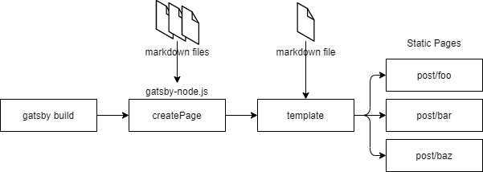

## はじめに

これまで技術記事は主に Qiita に載せてきましたが唐突に自分のブログが欲しくなり、以前から簡単に静的サイトが作れるという話を聞いていた Gatsby を使って作ることにしました。
Gatsby にはブログの始め方がスターター、テーマ、ほぼ自作と大きく分けて 3 つほどあり挙げた順に簡単です。
最初はスターターを使って簡単に始めようとしていたのですが、仕組みもよくわからず自分のブログという感じもしないのでテーマを使うことにしたのですが、これも面倒なところはブラックボックス化されており折角なので仕組みを知りたかった自分は大体自作することにしました。
自作といっても gatsby が提供しているプラグインを組み合わせて作るという感じなのでそこまで大変ではありません。
とりあえず満足のいくサイトが作れたので簡単にやったことをまとめたいと思います。
GitHub にコードは公開しています。
[https://github.com/ktny/kattsu-sandbox](https://github.com/ktny/kattsu-sandbox)

## やったこと

- markdown(mdx) からページを作成する
  - 記事ページを作成する
  - 全記事一覧ページを作成する
  - タグごとの記事一覧ページを作成する
- 機能関連
  - タグ機能を作成する
  - ページネーション機能を作成する
  - 目次機能を作成する
  - 各種コンポーネントを作成する
- UI 関連
  - typography.js で大まかな見た目を整える
  - コードブロックの見た目を整える
  - 画像を表示できるようにする
  - CSS Modules でスタイリングする
  - レスポンシブ対応を行う
- その他
  - TypeScript を使用する
  - Prettier を使用する
  - Google Analytics と紐付ける
  - 最低限の SEO 対策を行う
  - ソーシャルボタンを配置する
  - Vercel でデプロイする

Gatsby + Netlify + Contentful という構成をよく見ますが、Contentful は少し試してみて以下の理由で採用を見送りました。

- コンテンツをサイトと別管理することにそこまでメリットを感じられない
- 無料枠に限りがある
- エディタの書き心地がよくない

Contentful のような HeadlessCMS を使えば DB 含むバックエンドが不要ということで WordPress などの代替としてはいいのかなと思いますが、Gatsby で markdown ファイルからブログを作る分にはもともとバックエンド不要ですし、markdown で十分構造化されるので大してメリットが見い出せませんでした。
サイトと一緒に markdown ファイルでコンテンツを管理するメリットは GitHub に草が生えやすいことが知られています。

ホスティングサービスは今回は Vercel を使いましたが特殊な機能も使ってないので Netlify でも特に変わらないと思います。

## Gatsby で markdown からページが作られる仕組み

上で挙げたことのほとんどはプラグインを組み合わせれば実現できました。
ただ、根本的なところで、Gatsby でページが作られる仕組みの流れが最初よくわからなかったのでまとめておきます。
まず、Gatsby でページを作る仕組みは以下の 3 種類ありますが、markdown から記事ページを作るには 3 番目の gatsby-node.js の仕組みを採用します。
[Routing | Gatsby](https://www.gatsbyjs.com/docs/reference/routing/creating-routes/)

| 仕組み                   | 用途                             |
| :----------------------- | :------------------------------- |
| src/pages でルーティング | 単一の固定ページ                 |
| File System Route API    | src/pages 配下で複数の動的ページ |
| gatsby-node.js           | 上以外の用途での複数の動的ページ |

gatsby-node.js は`gatsby build`などのビルド時に走ります。
gatsby-node.js 内で サイト内の markdown ファイルの情報を GraphQL により取得し、そのファイルパスなどに合わせて createPages API を使用することで markdown を元にページルーティングを作ることができます。



このとき取得する markdown ファイルの情報は slug などルーティングを作るために必要な情報だけで、実際に記事の内容となる markdown の中身の情報などは template ファイルで改めて GraphQL で取得します。

```js:title=gatsby-node.js
const path = require(`path`)

// ページ作成前にslugフィールドをファイルパスから作成しておく
exports.onCreateNode = ({ node, getNode, actions }) => {
  const { createNodeField } = actions
  if (node.internal.type === `Mdx`) {
    const slug = createFilePath({ node, getNode, basePath: `pages` })
    createNodeField({
      node,
      name: `slug`,
      value: slug,
    })
  }
}

// 動的にページを作成
exports.createPages = async ({ graphql, actions }) => {
  const { createPage } = actions

  // graphqlでサイト内のmdxファイルのslugを取得
  const postsResult = await graphql(`
    query {
      allMdx {
        edges {
          node {
            fields {
              slug
            }
          }
        }
      }
    }
  `)

  // 記事ページを作成
  const posts = postsResult.data.allMdx.edges
  posts.forEach(({ node }) => {
    createPage({
      path: node.fields.slug,
      component: path.resolve(`./src/templates/post.tsx`), // このtemplateに合わせて動的に変換する
      context: {
        slug: node.fields.slug,
      },
    })
  })
}
```

なお、この gatsby-node.js を動かすためには、`gatsby-source-filesystem`, `gatsby-plugin-mdx` などのプラグインが必要になるかと思います。
あとは createPage の component オプションで指定した jsx,tsx ファイルにより個々のページごとに解決がなされ、MDXRenderer などにより markdown を DOM に変換できれば記事ページができあがります。

## おわりに

ブログを作っても大体すぐ飽きて終わってるんですが、今回はアウトプットの質を下げて量を増やすことを目標に頑張っていきたいと思います。
