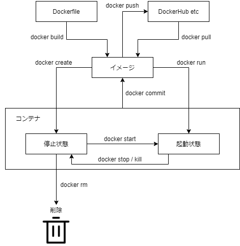
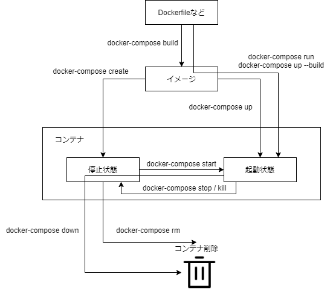

## コンテナとは

仮想化とは異なりホスト OS のカーネルを使用してプロセスを稼働する技術。仮想化はホスト OS の上に立つゲスト OS のカーネルを使用する。
そのままホスト OS のカーネルを実行するだけでは特定の環境を実現することはできないが、プロセスやファイルシステムなどの分離を **namespace** で、CPU やメモリなどリソースの割当を **cgroup** という Linux の機能で行うことによってホスト OS や他のコンテナとは区切られた特定の環境を実現することができる。
仮想化と比較してのメリットは**オーバーヘッドが少なく効率的**であること。

## Docker とは

コンテナによる特定環境の実現は unshare コマンドでの namespace の作成など複数のコマンドの実行によって行われる。
これら複数のコマンドの実行をひとまとめにして行えるのが Docker である。
また、Dockerfile によりそのような特定環境のカスタマイズも行うことができる。
Docker により特定環境の実現が誰でもほぼコマンド一発で行えるようになり、仮想化と比較して**移植性も高い**。

### コンテナのライフサイクル



```sh:title=alpineイメージでコンテナを起動
docker run -it alpine sh
```

Docker ではイメージを元にコンテナを作成する。
コンテナ内ではその環境に対して特定のライブラリをインストールするなど様々なコマンドを実行できるが、あらかじめそれらのコマンドが実行された状態で起動したければ Dockerfile をカスタマイズすることで可能だ。

```Dockerfile:title=Dockerfile
FROM alpine
RUN apk add vim
```

```sh:title=Dockerfileからビルドしたイメージでコンテナを起動
docker build -t sample .
docker run -it sample sh
/# vim
```

alpine イメージはデフォルトでは vim をインストールしないと使用できないが、Dockefile であらかじめインストールしたイメージを作成することでそのイメージでは使用できるようになる。

### 複数コンテナのライフサイクル

web3 層アーキテクチャに代表されるように web システムは通常 web サーバ、DB サーバなどいくつかの環境が組み合わさって動作している。
同じように複数のコンテナを組み合わせて動かしたいケースもあり、その場合は Docker Compose を使用するのが便利である。
複数コンテナでなく単一でも問題なく、素の Docker より扱いやすい場合も多い。



Docker Compose でのコンテナのライフサイクルは概ね上記のようになる。
一度ビルドしたイメージはキャッシュができるので再ビルドされないことに注意が必要。

```yml:title=docker-compose.yml
version: "3"

services:
  db:
    image: mysql
    command: --default-authentication-plugin=mysql_native_password
    restart: always
    environment:
      MYSQL_ROOT_PASSWORD: example
      MYSQL_DATABASE: mydb
      MYSQL_USER: myuser
      MYSQL_PASSWORD: mypassword
  adminer:
    image: adminer
    restart: always
    ports:
      - 8080:8080
```

[mysql - Docker Hub](https://hub.docker.com/_/mysql)
上記はほぼ MySQL の DockerHub から引っ張ってきたもので、`docker-compose up -d`と叩けば db と adminer それぞれのコンテナが起動状態になり、ブラウザから MySQL を操作することができる。
