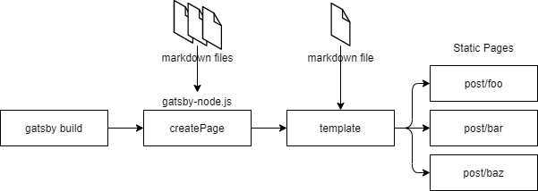

## はじめに

バージョンは下記で検証しています。
node.js: 14.13.0
gatsby: 2.26.1

ソースコードはこちらです。
[https://github.com/ktny/kattsu-sandbox](https://github.com/ktny/kattsu-sandbox)

## やりたいこと

markdown で frontmatter に`draft: true`としたものは**下書き状態として本番環境では公開しないが開発環境では確認できる**、`draft: false`としたものは開発環境でも本番環境でも公開されるようにしたいと思います。

```md:title=frontmatterの例
title: "Gatsby で下書き機能を作る"
date: "2020-12-30"
tags: ["Gatsby"]
draft: false
```

## やること



[以前の記事](../gatsby-original-blog)で説明したように markdown から個別記事ページが作られる仕組みは上のようになっています。
gatsby-node.js で本番環境で frontmatter によって createPage するファイルをフィルターすることでやりたいことはできそうです。
また、記事一覧ページについては記事一覧に出す内容自体もフィルターしたいので、内容を取得する template ファイルでフィルターする必要があります。

### gatsby-node.js で環境によって作成するページを絞る

```js:title=gatsby-node.js
exports.createPages = async ({ graphql, actions }) => {
  const { createPage } = actions
  // 本番環境ではfalseのみ、それ以外の環境ではtrue, falseでフィルターする
  const draft = process.env.NODE_ENV === "production" ? [false] : [true, false]
  const postsResult = await graphql(`
    query {
      allMdx(filter: { frontmatter: { draft: { in: [${draft}] } } }) {
        edges {
          node {
            fields {
              slug
            }
            frontmatter {
              tags
            }
          }
        }
      }
    }
  `)
}
```

ルーティング用の slug を取り出す GraphQL で本番環境では `in: [false]`、開発環境では`in: [true, false]`とすることで、本番環境では`draft: true`の markdown のページのルーティングは作られないようにします。

```js:title=gatsby-node.js
// 記事一覧ページを作成
paginate({
  createPage,
  items: posts,
  itemsPerPage: 10,
  pathPrefix: "/",
  component: path.resolve(`./src/templates/posts.tsx`),
  context: {
    draft: draft,
  },
})
```

ルーティングですでにフィルターされているので、記事個別の createPageAPI には draft 環境変数を渡す必要はありませんが、記事一覧系のページでは template ファイルで改めてタイトルなどを取得するため、gatsby-node.js から現在の環境を context で渡します。
（ページネーションのため`gatsby-awesome-pagination`プラグインを使用した記述になっています。）

### 記事一覧用の template で取得するページを絞る

```js:title=src/templates/posts.tsx
import Posts from "../components/posts"
import { graphql } from "gatsby"

export default Posts

export const query = graphql`
  query Posts($skip: Int!, $limit: Int!, $draft: [Boolean]!) {
    allMdx(
      sort: { fields: [frontmatter___date], order: DESC }
      filter: { frontmatter: { draft: { in: $draft } } }
      skip: $skip
      limit: $limit
    ) {
      nodes {
        fields {
          slug
        }
        frontmatter {
          title
          date
          tags
        }
      }
    }
  }
`
```

gatsby-node.js から渡した draft 変数を template ファイルでも使用して環境により取得する markdown ファイルをフィルターします。
これで記事一覧の内容もフィルターされたものになります。

## おわりに

ページが作られる仕組みがわかるとプラグインも要らずけっこう簡単です。
同じように frontmatter に公開予定日を記述することで予定日以降では公開状態にするということもできそうです。
