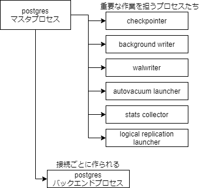

## はじめに

本記事は[PostgreSQL Advent Calendar 2020](https://qiita.com/advent-calendar/2020/postgresql)の 10 日目です。
PostgreSQL のメモリ管理についていろいろと壁にぶつかったのでわかる範囲で知見をまとめていきたいと思います。
PostgreSQL のバージョンは 13.1 で検証しています。

## なぜメモリ管理を適切にする必要があるのか

そもそもですが、なぜメモリ管理を適切にする必要があるのでしょうか。
簡潔に言うと **パフォーマンスと安定性のため** と言えるかと思います。

まず、データベースのデータはすべてファイルとしてディスクに保存することで永続化されます。
データを取得・更新する際にはディスクへの読み書きが発生するのですが、これはメモリに比べて非常に遅いことが知られています。
では、可能な限りメモリから読み書きするようにすればいいのかというと、通常データベースが扱うサイズは搭載メモリサイズよりも大きいことが多く、搭載メモリ以上にメモリを使用しようとすると OOM エラーが発生しシステム全体がダウンしてしまう可能性もあります。
そのため、安定性を保った上でパフォーマンスが向上するよう適切なメモリ管理を行う必要があります。

## PostgreSQL のプロセス構成

メモリ管理の前に簡単に PostgreSQL のプロセス構成を知る必要があります。
下記は PostgreSQL が動くサーバ上で postgres に関連するプロセスを表示した結果です。

```sh
$ ps aux | grep postgres
postgres     1  0.0  0.3 213892 26500 ?        Ss   Dec05   0:07 postgres
postgres    66  0.0  0.8 214024 70144 ?        Ss   Dec05   0:00 postgres: checkpointer
postgres    67  0.0  0.0 213892  5688 ?        Ss   Dec05   0:01 postgres: background writer
postgres    68  0.0  0.1 213892  9980 ?        Ss   Dec05   0:02 postgres: walwriter
postgres    69  0.0  0.1 214448  8528 ?        Ss   Dec05   0:07 postgres: autovacuum launcher
postgres    70  0.0  0.0  68540  5640 ?        Ss   Dec05   0:14 postgres: stats collector
postgres    71  0.0  0.0 214324  6756 ?        Ss   Dec05   0:00 postgres: logical replication launcher
postgres  8833  0.0  0.1 214824 14232 ?        Ss   01:35   0:00 postgres: pguser pguser [local] idle
postgres  9082  0.0  0.1 214824 11688 ?        Ss   02:11   0:00 postgres: pguser pguser [local] idle in transaction
```

複数のプロセスから PostgreSQL が成り立っていることがわかりますが、重要なのは下記図のように全体を管理するマスタプロセス、walwriter のように PostgreSQL の重要な作業を担うプロセス、接続ごとに作られるバックエンドプロセスの**3 種に分けられるマルチプロセス構成**であることです。
（ちなみに MySQL はマルチプロセス構成ではなく、マルチスレッド構成なのでこのように複数のプロセスに分かれていません。）



重要な作業を担うプロセスたちについては説明を割愛しますが、これらのプロセスも当然メモリを使用しています。
バックエンドプロセスは`pguser pguser [local] idle`などとなっているもので、これらのプロセスは接続ごとに自分だけのメモリ域を持ちます。詳しくは次で説明します。

## 共有メモリ域とプロセスメモリ域

PostgreSQL のメモリ管理は共有メモリ域とプロセスメモリ域の 2 つに大別されます。
共有メモリ域は PostgreSQL 全体が使用する領域で、**どのプロセスからでも参照できます。**この領域はサーバ起動時のみ確保領域が決定されます。shared_buffers, wal_buffers, Free Space Map, Visibility Map が存在します。
プロセスメモリ域はバックエンドプロセスごとに確保される作業用のメモリ域で**メモリ領域を確保したプロセスのみが参照可能です。**この領域はプロセスごとに SET コマンドで途中から確保領域を決められます。work_mem, maintenance_work_mem, temp_buffers が存在します。

この中で特に重要な shared_buffers と work_mem について解説します。

### shared_buffers（共有メモリ域）

テーブルやインデックスのデータなどがキャッシュされます。
初期値は 128MB ですが、これはかなり小さい値で、公式では**1GB 以上の RAM があれば 1/4 のサイズを割り当てるのが妥当**と言われています。

> 1GB 以上の RAM を載せた専用データベースサーバを使用している場合、shared_buffers に対する妥当な初期値はシステムメモリの 25%です。

それ以上割り当てることが有効なケースもありますが、大きすぎるサイズを割り当てるとバッファ探索にかかる時間も増えてしまうため、大きくしすぎないことも重要なようです。

> shared_buffers をこれよりも大きな値に設定することが有効なワークロードもあります。 しかし、PostgreSQL はオペレーティングシステムキャッシュにも依存するため、shared_buffers に RAM の 40%以上を割り当てても、それより小さい値の時より動作が良くなる見込みはありません。

### work_mem（プロセスメモリ域）

クエリ中の並び替えやハッシュテーブル操作など一部の操作で使用する最大メモリサイズを決定します。初期値は 4MB です。
特に ORDER BY, JOIN, GROUP BY などを使用するクエリのパフォーマンスを考慮するときこの値は重要です。

試しに work_mem を変えることでどの程度実行時間が異なるのか実験してみます。

```sql
-- レコード数を増やすためのテーブルを作成
create table digit(num integer);
insert into digit values (0), (1), (2), (3), (4), (5), (6), (7), (8), (9);

-- 1から1000までのランダムな数値列を持つ10万件のテーブルを作成
create table sales (user_id int, amount int);
insert into sales (select ceil(random() * 10) as user_id, ceil(random() * 1000) as amount from digit d1, digit d2, digit d3, digit d4, digit d5);
```

この sales テーブルに対して work_mem を変動させてクエリを投げてみます。

#### work_mem が異なる値でのクエリの比較

##### work_mem が小さいとき

```sql
set work_mem='128kB';
explain analyze select * from sales order by amount;
```

```sql
                                                    QUERY PLAN
------------------------------------------------------------------------------------------------------------------
 Sort  (cost=12484.82..12734.82 rows=100000 width=8) (actual time=53.370..62.647 rows=100000 loops=1)
   Sort Key: amount
   Sort Method: external merge  Disk: 1784kB
   ->  Seq Scan on sales  (cost=0.00..1443.00 rows=100000 width=8) (actual time=0.011..7.197 rows=100000 loops=1)
 Planning Time: 0.049 ms
 Execution Time: 65.617 ms
(6 rows)
```

##### work_mem が十分にあるとき

```sql
set work_mem='8MB';
explain analyze select * from sales order by amount;
```

```sql
                                                    QUERY PLAN
------------------------------------------------------------------------------------------------------------------
 Sort  (cost=9747.82..9997.82 rows=100000 width=8) (actual time=22.454..33.987 rows=100000 loops=1)
   Sort Key: amount
   Sort Method: quicksort  Memory: 7419kB
   ->  Seq Scan on sales  (cost=0.00..1443.00 rows=100000 width=8) (actual time=0.014..6.927 rows=100000 loops=1)
 Planning Time: 0.047 ms
 Execution Time: 37.011 ms
(6 rows)
```

単純なランダムな数値列の並び替えでの SELECT クエリで 128kB と 8MB で比較してみました。
単純な実行時間では 65ms, 37ms と約 2 倍の差が出ました。
実行計画を読むと work_mem が小さいときは `Disk: 1784kB` とディスクを使用しているのに対し、work_mem が十分にあるときは `quicksort Memory: 7419kB` とメモリを使用したクイックソートが行われているのがわかります。
なお、並び替えのない単純な `select * from sales` ではこの work_mem の比較でもほとんど実行時間に差がありませんでした。
このことからどのようなクエリでも work_mem を増やすことで効果があるわけではなく、一時的にメモリを使用するような一部のクエリで効果が見込めることがわかります。

※おそらくディスクキャッシュなどもあるため、メモリとディスクの違いがあれば必ずこの程度の性能差が出るとも限らず、データ量やクエリによっては一方がメモリ、一方がディスクから読む場合でもほぼ実行時間が変わらないケースもありました。

今回は ORDER BY を使用したクエリで実験してみましたが、下記のように一時的にメモリを使用するようなクエリは多いので、かなりのケースで有効だと言えると思います。

> 並び替え操作は ORDER BY、DISTINCT、およびマージ結合に対して使われます。 ハッシュテーブルはハッシュ結合、ハッシュに基づいた集約、および IN 副問い合わせのハッシュに基づいた処理で使用されます。

ただし、work_mem のサイズの決定は概ねメモリの 1/4 を設定するのがベストプラクティスとなっている shared_buffers よりも難しく、ここを誤ると**一部のクエリではパフォーマンスが向上しても安定性に欠けるおそれ**が出てきます。

#### work_mem のサイズの決定

work_mem が大きければ一部クエリで効果が見込めることはわかりましたが、work_mem を大きすぎる値にすることは下記の理由で OOM エラーの危険をともないます。

- バックエンドプロセスごとにそれぞれの work_mem が存在している
- work_mem は 1 クエリの中で使用される最大メモリサイズとは限らない
- プランナは空きメモリ量から実行計画を決定しない、また見積もりは必ずしも正確ではない

##### バックエンドプロセスごとにそれぞれの work_mem が存在している

こちらは上述したとおりで、work_mem はプロセスメモリ域に属するのでバックエンドプロセスごとに存在します。
バックエンドプロセスは最大で max_connections まで増加するので同時にそれらが接続され、work_mem を使用するクエリが投げられた場合、少なくとも`max_connections * work_mem`分のメモリが消費されます。

##### work_mem は 1 クエリの中で使用される最大メモリサイズとは限らない

複雑なクエリでは、1 クエリ内で同時に並び替えや JOIN, GROUP BY のハッシュ操作を行うことがありますが、これらの場合そのような操作ごとに work_mem を消費します。
つまり、バックエンドプロセスが 1 つだったとしても、**クエリによっては指定した work_mem の数倍のメモリが消費される**ことがあります。
また、PostgreSQL にはパラレルクエリという仕組みがあり、1 クエリを投げたつもりでも複数クエリで並行して読み込むことが適した大きいデータであるなどとプランナが判断した場合には、複数のクエリが並行して投げれられます。
1 クエリで使用されるパラレルワーカーの数は max_parallel_workers_per_gather で決定されます。
複雑なクエリである場合と、**パラレルクエリにより 1 プロセス内でも work_mem の数倍のメモリサイズが消費される**場合があります。
このことはバックエンドプロセスごとにそれぞれの work_mem が存在していることと合わせて公式でも次のように説明されています。

> 複雑な問い合わせの場合、いくつかの並び替えもしくはハッシュ操作が並行して実行されることに注意してください。 それぞれの操作による一時メモリへの書き込み開始の前に、この値が指定するのと同じメモリ容量の使用をそれらの操作に許容します。 さらに、いくつかの実行中のセッションはこれらの動作を同時に行います。 したがって、使用されるメモリの合計は、work_mem の数倍になります。

##### プランナは空きメモリ量から実行計画を決定しない、また見積もりは必ずしも正確ではない

仮に最悪ケースで搭載メモリ量を超える work_mem を指定したとしても、実際にその最悪ケースのときにはメモリを使わずディスクから読み書きするようにプランナが実行計画を変えてくれるのでは？とも思えます。
しかし、ソースは見つからなかったのですが、挙動を見ている限りでは実行計画は空きメモリ量を判断材料に加えていることはありません。
おそらくは、テーブル行数などの統計情報、work_mem などのメモリ設定、クエリ自体から最適な実行計画を判断していると思われ、仮にその時点で空きメモリ量がほとんどなかったとしても、上記から計算される実行計画がメモリをフルに使用するものであれば構わず使ってしまうのです。

例えば、work_mem の計算に max_parallel_workers_per_gather を入れずに設定したところ、CPU コア数の多い環境ではパラレルクエリが実行されることで推測していた数倍の work_mem が使用された結果システムがダウンするということがありました。

また、これは work_mem のサイズをどう決定しても起き得る話なのですが、プランナが出す実行計画は統計情報などを元に決定されますが、この統計情報を正しく使用できないケースが存在します。
例えば、ビューや CTE は統計情報を持たないので、これらに対し GROUP BY をかけると正しい行数を見積もれず、本来であれば巨大なハッシュテーブルをメモリ上に作成できないため Hash Aggregate ではなく Group Aggregate を使うべきところが、Hash Aggregate を使用してしまいダウンするというケースがありました。
もちろん、ビューも CTE も元となるテーブルがあるため遡れば統計情報を活用できるはずですが、集約の key となる列に対して変更が入っているなどすると正しく統計情報を使用できないことがあるようです。

※なお、PostgreSQL13 ではこの問題は改善されており work_mem 以上のハッシュテーブルになる場合はディスクを使用するようになっているため、OOM エラーを起こすことはなくなりました。
ただし、上記のように見積もりを誤ることは依然としてあるため、Group Aggregate の方が高速だが Hash Aggregate を使用してしまうケースなどは存在します。

> Allow hash aggregation to use disk storage for large aggregation result sets (Jeff Davis)
> Previously, hash aggregation was avoided if it was expected to use more than work_mem memory. Now, a hash aggregation plan can be chosen despite that. The hash table will be spilled to disk if it exceeds work_mem times hash_mem_multiplier.

[PostgreSQL 13.0 Release Notes](https://www.postgresql.org/docs/release/13.0/)

##### では、work_mem のサイズはどう決定すればいいのか？

ここまでの話から work_mem には少なくとも下記の因子が関わることがわかりました。

- max_connections：最大接続数
- max_parallel_workers_per_gather: 1 プロセスでの最大のパラレルワーカー数
- 1 クエリでの並び替えや JOIN, GROUP BY のハッシュ操作の数

また、ここで work_mem が使用できる領域はデータベースが使用できるメモリサイズから shared_buffers などの共有メモリ領域はあらかじめ引いた方が得策です。
PostgreSQL のチューニングサイトで有名な[PGTune](https://pgtune.leopard.in.ua/#/)では work_mem の設定に関して以下のようにコメントがあります。

> work_mem is assigned any time a query calls for a sort, or a hash, or any other structure that needs a space allocation, which can happen multiple times per query. So you're better off assuming max_connections \* 2 or max_connections \* 3 is the amount of RAM that will actually use in reality. At the very least, you need to subtract shared_buffers from the amount you're distributing to connections in work_mem.
> The other thing to consider is that there's no reason to run on the edge of available memory. If you do that, there's a very high risk the out-of-memory killer will come along and start killing PostgreSQL backends. Always leave a buffer of some kind in case of spikes in memory usage. So your maximum amount of memory available in work_mem should be ((RAM - shared_buffers) / (max_connections \* 3) / max_parallel_workers_per_gather).

そして、計算方法は次のようになっています。
`(RAM - shared_buffers) / (max_connections * 3) / max_parallel_workers_per_gather`

では、**max_connections や max_parallel_workers_per_gather はどう決定すればよいかが決まれば work_mem も決めることができそう**です。
max_connections は自分が運用しているシステムの特性にも大きく関わってくるので一概には言うことができません。
PGTune でも Web アプリであれば 200, DWH であれば 40 とするなどしており、運用しているシステムがどれくらいの接続を見込んでいるかから決めるのがよいです。
max_connections に掛けられている 3 の係数ですが、これは上述した「1 クエリでの並び替えや JOIN, GROUP BY のハッシュ操作の数」であり、これも自分が運用するシステムによってある程度決めるべきでしょう。大概は 3 程度あれば十分なように思います。
max_parallel_workers_per_gather は、CPU コア数の 1/2 とするのがベストプラクティスのようです。

## まとめ

- パフォーマンスと安定性向上のためメモリ管理を行う
- PostgreSQL はマスタプロセス、WAL ライタなどの特殊なプロセス、接続ごとのバックエンドプロセスのマルチプロセス構成
- PostgreSQL には共有メモリ域とバックエンドプロセスごとのプロセスメモリ域が存在する
- 共有メモリ域で重要な shared_buffers は概ね割当メモリの 1/4 がベストプラクティス
- プロセスメモリ域で重要な work_mem は`(RAM - shared_buffers) / (max_connections * 3) / max_parallel_workers_per_gather`がベストプラクティス
  - max_connections や係数である 3 などは自らが運用するシステム次第で決定すること
  - max_parallel_workers_per_gather は CPU コア数の 1/2 がベストプラクティス

## 参考情報

- [PostgreSQL 第 19 章 サーバの設定](https://www.postgresql.jp/document/12/html/runtime-config-resource.html#RUNTIME-CONFIG-RESOURCE-MEMORY)
- [内部構造から学ぶ PostgreSQL 設計・運用計画の鉄則](https://www.amazon.co.jp/dp/4297100894/ref=cm_sw_r_tw_dp_x_AliZFbDFX6MSN)
- [PGTune](https://www.postgresql.org/docs/release/13.0/)
